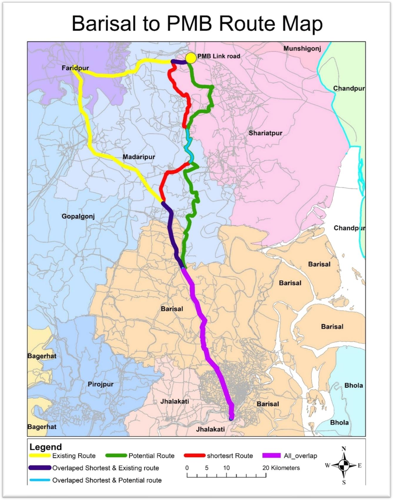
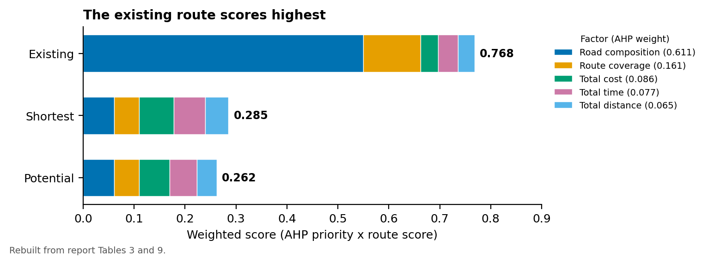
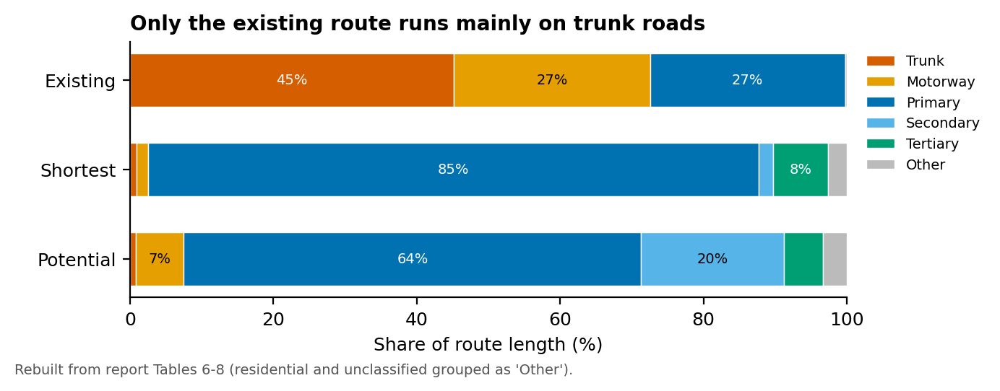

# Route Selection from Barishal to the Padma Bridge Link Road: GIS Network Analysis with AHP

**Studio project, Dept. of Urban and Regional Planning, KUET**

## Summary

The Padma Multipurpose Bridge links south-west Bangladesh directly to Dhaka. Which road should carry Barishal's traffic to it? We compared three routes from Barishal to the bridge link road: the **existing** route via Faridpur, the **shortest** network path and a **potential** new alignment via Shariatpur. We built a road network dataset in ArcGIS and ran network analysis to measure the length, travel time and cost of each route and its mix of road classes. We then ranked the routes with an Analytic Hierarchy Process (AHP) over five factors. **Road composition** carried most of the weight (61.1%), and the **existing route scored highest (0.768)**. It is the only route that runs mostly on trunk roads, so the alternatives would need major new construction.



## Study area

The corridor between Barishal city and the Padma Bridge link road, across Barishal, Madaripur, Shariatpur, Gopalganj and Faridpur districts.

## Data

| Data | Details |
|---|---|
| Road network | Road classes from trunk to unclassified, with speed limits, junctions and stops, built into a network dataset |
| Travel cost | Cost per road segment (Tk) |
| Expert judgements | Pairwise comparisons of 5 route-selection factors on the Saaty 1–9 scale |

## Method

1. Built a network dataset in ArcGIS and solved the existing, shortest and potential routes.
2. Summarised each route's length, time and cost by road class, and measured where the routes overlap. All three routes share a 40.3 km section.
3. Ran AHP on 5 factors: road composition (0.611), route coverage (0.161), total cost (0.086), total time (0.077) and total distance (0.065). CR = 5.4%, λmax = 5.242.
4. Scored each route from 0 to 1 on each factor and summed the weighted scores.

## Results

| Route | Via | Trunk road share | Weighted score |
|---|---|---|---|
| Existing | Madaripur, Gopalganj, Faridpur | 45.2% | **0.768** |
| Shortest | Madaripur, Shariatpur | 0.9% | 0.285 |
| Potential | Madaripur, Shariatpur | 0.8% | 0.262 |

- Network analysis: the shortest route measured 119.5 km (about 2.85 h) and the potential route 137.3 km (about 3.27 h). The existing route is the longest and slowest of the three.
- The shortest route is the fastest and cheapest, but it uses almost no trunk road. Upgrading it would mean building most of its length as new trunk road.
- The existing route covers the most districts (4) and has the best road composition, so it ranks first once road composition dominates the weighting.





## Tools

ArcGIS (Network Analyst) · AHP pairwise comparison · Microsoft Excel · Python/matplotlib (redrawn charts in [`viz/`](viz/))

## Repository contents

```
images/   original route map (unchanged) + redrawn charts
viz/      make_figures.py and data/*.csv (Tables 3, 6-9 from the report)
```

## Contact

Chinmoy Ghosh Shuvo · Open to collaboration and knowledge sharing. Feel free to reach out on [LinkedIn](https://www.linkedin.com/in/chinmoyghosh034).
